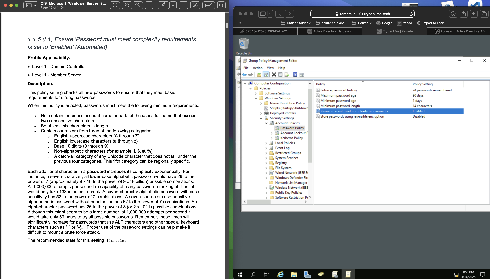
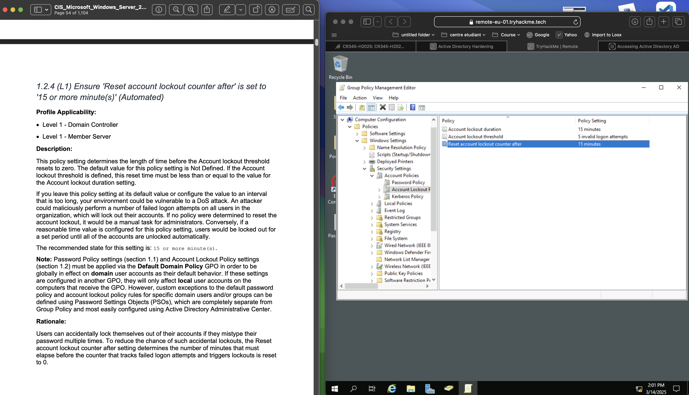

# Windows Server 2019 Hardening & Auditing Project

## Objective
This project focuses on hardening and auditing a Windows Server 2019 environment using the [CIS Microsoft Windows Server 2019 Benchmark](https://www.cisecurity.org/benchmark/microsoft_windows_server). The goal is to implement security configurations to enhance system security and compliance.

## Steps

### Step 1: Initial Setup & Benchmark Selection
- Configured a virtual machine running Windows Server 2019 and selected the CIS benchmark as the security guideline.

### Step 2-6: Password Policy Hardening
- **Step 2:** Enforced password history to 24 or more passwords. 
- **Step 3:** Reviewed the default value of this policy. 
- **Step 4:** Set the maximum password age to 365 or fewer days, but not 0. 
- **Step 5-6:** Applied a 90-day password reset policy.  

### Step 7-10: Strengthening Password Requirements
- **Step 7:** Ensured minimum password age was 1 or more days. 
- **Step 8:** Minimum password length defaulted to 7 characters. 
- **Step 9:** Increased minimum password length to 14 characters. 
- **Step 10:** Verified password complexity requirements were enabled. 

### Step 11: Secure Password Storage
- **Step 11:** Ensured 'Store passwords using reversible encryption' was disabled. 

### Step 12-15: Account Lockout Policy
- **Step 12:** Account lockout duration was not defined by default. 
- **Step 13:** Set account lockout duration to 15 minutes. 
- **Step 14:** Ensured lockout threshold was set to 5 or fewer invalid logon attempts. 
- **Step 15:** Configured reset lockout counter after 15 minutes. 

### Step 16-21: User & Network Access Controls
- **Step 16:** Restricted Access Credential Manager as a trusted caller to No One.  
- **Step 18-19:** Configured network access settings for authenticated users.  
- **Step 20:** Restricted "Act as part of the operating system" to No One. 
- **Step 21:** Limited "Add workstations to domain" to Administrators. 

### Step 22-24: Print Spooler Security
- **Step 22:** Audited Print Spooler settings via registry. 
- **Step 23:** Disabled Print Spooler for Domain Controllers.  

### Step 25-26: Windows Firewall Configuration
- **Step 25:** Enabled Windows Firewall: Domain: Firewall state. 
- **Step 26:** Configured inbound connections to be blocked by default. 

## Conclusion
This project successfully implemented Windows Server 2019 hardening measures, covering:

✔️ Enforcing strong password policies  
✔️ Implementing account lockout policies  
✔️ Restricting user and network access controls  
✔️ Disabling unnecessary services like Print Spooler  
✔️ Configuring Windows Firewall for security enforcement  

This security hardening ensures compliance with the CIS Benchmark and enhances the overall security posture of the system. 🚀
